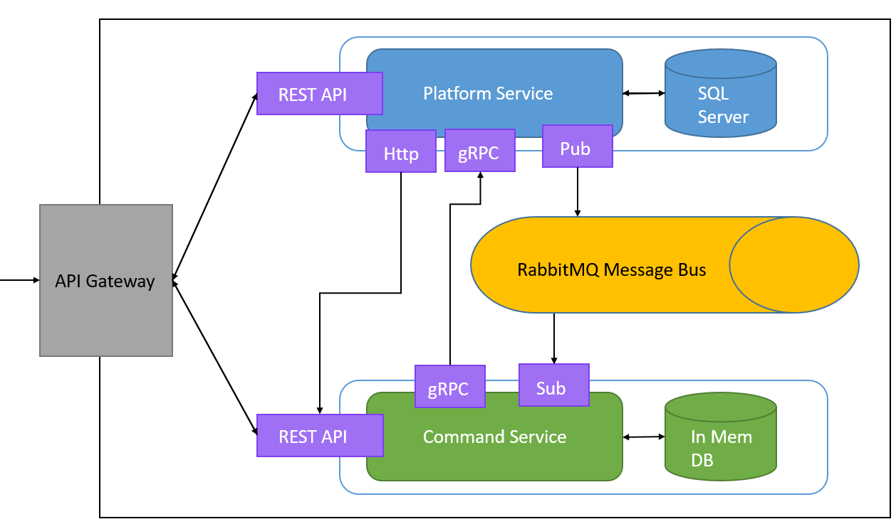
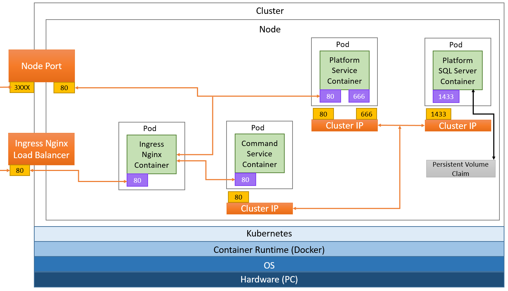

# Microservices Implementation

The following Microservice implementation is designed following the tutorial found [here](https://www.youtube.com/watch?v=DgVjEo3OGBI).

## Overview

This project consists of two microservices deployed as Docker containers to a Kubernetes cluster with an API Gateway.
The components contained in this project include:

- Platform Service
- Command Service
- Docker Containers
- K8S Deployment
- RabbitMQ Message Bus
- Ingress
- API Gateway

The APIs can communicate synchronously (via HTTP and gRPC) and asynchronously (via RabbitMQ)

## Architecture Overview

### Microservice Architecture

### Kubernetes Architecture

